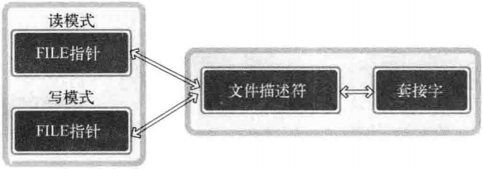
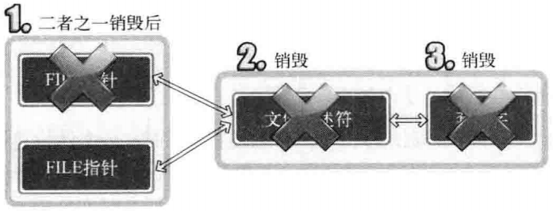
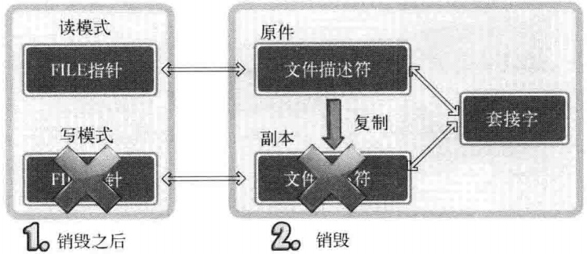
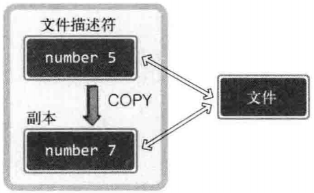

## IO分离
- fork() 一个进程负责读或写数据
- fdopen() 函数，创建读模式 FILE 指针和写模式 FILE 指针

## 流分离带来的 EOF 问题
调用 fclose() 函数完全终止的套接字，而不是半关闭

## 文件描述符的复制
### 终止流时无法半关闭的原因
读模式 FILE 指针和写模式 FILE 指针都是基于同一文件描述符创建的，针对任意一个 FILE 指针调用 fclose() 函数是都会关闭文件描述符，终止套接字。

 



### 复制文件描述符后穿件 FILE
可以复制后另外创建1个文件描述符，然后利用各自的文件描述符生成读模式 FILE 指针和写模式 FILE 指针（不是半关闭，不但没有发送 EOF，而且仍然可以利用文件描述符进行双工通信）



### 同一进程内文件描述符复制（两个不同的文件描述符）

表示“为了访问同一文件或套接字，创建另一个文件描述符”

  

## dup() & dup2()
```
#include <unistd.h>
int dup(int fildes);               // 成功时返回复制的文件描述符，失败时返回 -1
int dup2(int fildes, int fildes2); // fildes2 是明确指定目的文件描述符的值。成功时返回复制的文件描述符，失败时返回 -1
```
无论复制出多少文件描述符，均应调用 shutdown() 函数发送 EOF 并进入半关闭状态