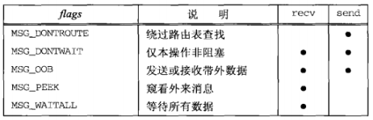

## 套接字超时
- 调用 alarm()，在指定超时器满时产生 SIGALRM 信号
- 在 select() 中阻塞等待 IO，以此代替直接阻塞在 read() 或 write() 调用上
- 使用较新的 SO_RCVTIMEO 和 SO_SNDTIMEO 套接字选项（但是并非所有实现支持这两个套接字选项）。

## recv() 和 send() 函数
```
#include <sys/socket.h>
/* @param
 * sockfd：表示与数据传输对象连接的套接字文件描述符
 * buf：保存待传输数据的缓冲地址
 * nbytes：待传输的字节数
 * flags：传输数据时指定的可选项信息
 * return：成功时返回发送的字节数，失败时返回 -1
 */
ssize_t send(int sockfd, const void *buf, size_t nbytes, int flags);

/* @param
 * sockfd：表示数据接收对象的连接的套接字文件描述符
 * buf：保持接收数据的缓冲地址
 * nbytes：可接收的最大字节数
 * flags：接受数据时指定的可选项信息
 * return：成功时返回接受的字节数（收到 EOF 时返回0），失败时返回-1
 */
ssize_t recv(int sockfd, void *buf, size_t nbytes, int flags);
```


MSG_OOB：发送紧急消息
- 督促数据接受对象尽快处理数据
- TCP“保持传输顺序”的传输特性依然成立

MSG_PEEK 和 MSG_DONTWAIT：检查输入缓冲中是否存在接收的数据
- 设置 MSG_PEEK 选项并调用 recv() 函数时，即使读取了输入缓冲的数据也不会删除。
- 常与 MSG_DONTWAIT 合作，用于调用以非阻塞方式验证待读数据存在与否

## readv() & writev() 函数
- 对数据进行整合传输及发送的函数
- 通过 writev() 函数可以将分散保存在多个缓冲中的数据一并发送
- 通过 readv() 可以由多个缓冲分别接受

```
#include <sys/uio.h>
/* @param
 * filedes：表示数据传输对象的套接字文件描述符，但不仅限于套接字，也可以是文件或标准输出描述符
 * iov：iovec结构体数组的地址
 * iovcnt：向第二个参数传递的数组长度
 * return：成功时返回发送的字节数，失败时返回 -1
 */
ssize_t writev(int filedes, const struct iovec *iov, int iovcnt);

struct iovec {
  void  *iov_base; // 缓冲地址
  size_t iov_len;  // 缓冲大小
};

/***比如****************************
 * writev(1, ptr, 2);
 *         --------
 * ptr--->|iov_base|--->|A|B|C|.|.|
 *        |iov_len |--->|3|
 *         --------
 *        |iov_base|--->|1|2|3|4|.|
 *        |iov_len |--->|4|
 *         --------
 **********************************/

 /* @param
  * filedes：接收数据的文件（或套接字）描述符
  * iov：iovec结构体数组的地址
  * iovcnt：数组长度
  * return：成功时返回接收的字节数，失败时返回-1
  */
ssize_t readv(int filedes, const struct iovec *iov, int iovcnt);
```

## recvmsg() 和 sendmsg() 函数
```
#include <sys/socket.h>
ssize_t recvmsg(int sockfd, struct msghdr *msg, int flags);
ssize_t sendmsg(int sockfd, struct msghdr *msg, int flags);

struct msghdr {
  void         *msg_name;
  socklen_t     msg_namelen;
  struct iovec *msg_iov;
  int           msg_iovlen;
  void         *msg_control;
  socklen_t     msg_controllen;
  int           msg_flags;
};
```

## 排队的数据量
不真正读取数据的前提下知道一个套接字上已有多少数据排队等着读取
- 如果获悉已排队数据量的目的在于避免读取操作阻塞，可以使用非阻塞 IO
- 既想查看数据，又像数据仍然留在接收队列中供本进程其他部分稍后读取，可以使用 MSG_PEEK 标志
- 一些实现支持 ioctl 的 FIONREAD 命令