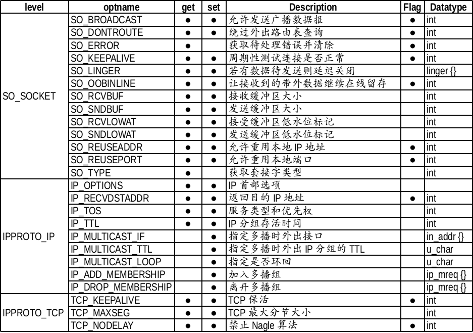
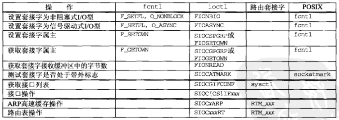

## 套接字多种可选项


## getsockopt() 和 setsockopt() 函数
```
#include <sys/socket.h>
/*@ param
 * sock：用于查看选项套接字文件描述符
 * level：要查看的可选项的协议层
 * optname：要查看的可选名
 * optval：保存查看结果的缓冲地址值
 * optlen：缓冲字节数
 * return：成功时返回 0,失败时返回 -1
 */
int getsockopt(int sock, int level, int optname, void *optval, socklen_t *optlen);

/*@ param
 * sock：用于更改选项套接字文件描述符
 * level：要更改的可选项的协议层
 * optname：要更改的可选名
 * optval：保存要更改结果的缓冲地址值
 * optlen：缓冲字节数
 * return：成功时返回 0,失败时返回 -1
 */
int setsockopt(int sock, int level, int optname, const void *optval, socklen_t optlen);
```

## SO_KEEPALIVE 套接字选项
给一个 TCP 套接字设置保持存活（keep-alive）选项后，如果 2 小时内在该套接字的任一方向上都没有数据交换，TCP 就自动给对端发送一个保持存活探测分节（keep-alive probe）。这是一个对端必须响应的 TCP 分节，它会导致以下三种情况之一：
- 对端以期望的 ACK 响应。应用进程得不到通知（因为一切正常）。在又经过仍无动静的 2 小时后，TCP 将发出另一个探测分节
- 对端以 RST 响应，它告知本端 TCP：对端已崩溃且已重新启动。该套接字的待处理错误被设置为 ECONNRESET，套接字本身则被关闭
- 对端对保持存活探测没有任何响应。该套接字的待处理错误被设置为 ETIMEOUT，套接字本身则被关闭。然而如果该套接字收到一个 ICMP 错误作为某个探测分节的响应，那就返回响应的错误，套接字本身也被关闭。

### SO_REUSEADDR
Time-wait 状态：先断开连接的（先发送 FIN 消息的）主机要经过 TIME_WAIT 状态，确保 TCP 连接正常关闭。此时相应的端口是正在使用的状态，调用 bind() 函数会发生错误。

地址再分配
- ACK 丢失，再次收到 FIN 包会重启 TIME_WAIT 计时器
- 更改套接字的 SO_REUSEADDR 状态，可将 TIME_WAIT 状态下的套接字端口号重新分配给新的套接字

### SO_LINGER
SO_LINGER 选项用于控制 close() 系统调用在关闭 TCP 连接时的行为。默认情况下，当使用 close() 系统调用来关闭一个套接字时，close() 将立即返回，TCP 模板负责把该套接字对应的 TCP 发送缓冲区中残留的数据发送给对方。设置或获取 SO_LINGER 选项的值时，使用 linger 类型的结构体
```
#include <sys/socket.h>
struct linger {
  int l_onoff;  // 开启（非 0）或关闭（0）该选项
  int l_linger; // 滞留时间
};
```
根据 linger 结构体中两个成员变量的不同值，close() 系统调用可能产生如下 3 种行为之一：
1. l_onoff 为 0。此时 SO_LINGER 选项不起作用
2. l_onoff 不为 0，l_linger 为 0。此时 close() 系统调用立即返回，TCP 模块将丢弃被关闭的套接字对应的 TCP 发送缓冲区中残留的数据，同时给对方发送一个 RST 分节。这种情况给服务器提供了异常终止一个连接的方法
3. l_onoff 不为 0，l_linger 大于 0。此时 close() 的行为取决于两个条件：一是被关闭的套接字对应的 TCP 发送缓冲区中是否还有残留的数据；二是该套接字是阻塞的，还是非阻塞。对于阻塞的套接字，close() 将等待一段长为 l_linger 的时间，直到 TCP 模块发送完所有残留数据并得到对方的确认。如果这段时间内 TCP 模块没有发送完残留数据并得到对方的确认，那么 close() 将发挥 -1 并设置 errno 为 EWOULDBLOCK。如果套接字是非阻塞的，close() 将立即返回，此时我们需要根据其返回值和 errno 来判断残留数据是否已经发送完毕。

### TCP_NODELAY
Nagle 算法
- 只有收到前一数据的 ACK 消息时，Nagle 算法才发送下一数据
- TCP 默认使用 Nagle 算法交换数据，因此最大限度地进行缓冲，直到收到 ACK
- 减少小数据包，提高网络传输效率
- 网络流量未受太大影响时，不使用 Nagle 算法要比使用它时传输速度快。最典型的是“大文件传输”应禁用 Nagle 算法

禁用 Nagle 算法
```
int option = 1;
setsockopt(sock, INPROTO_TCP, TCP_NODELAY, (void*)&option, sizeof(option));
```

## fcntl() 函数
```
#include <fcntl.h>
int fcntl(int fd, int cmd, ... /*int arg */);
```
与代表“file control”的名字相符，fcntl() 函数可执行各种描述符控制操作
- 非阻塞 IO。通过使用 F_SETFL 命令设置 O_NONBLOCK 文件状态标志，可以把一个套接字设置为非阻塞型
- 信号驱动式 IO。通过使用 F_SETFL 命令设置 O_ASYNC 文件状态标志，可以把一个套接字设置成一旦其状态发生变化，内核就产生一个 SIGIO 信号
- F_SETOWN 命令允许我们指定用于接收 SIGIO 和 SIGURG 信号的套接字属主（进程 ID 或进程组 ID）。其中 SIGIO 信号是套接字被设置为信号驱动式 IO 型后产生的， SIGURG 信号是在新的带外数据到达套接字产生的。 F_GETOWN 命令返回套接字的当前属主

