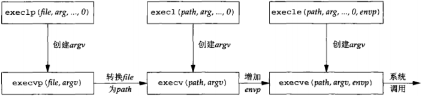
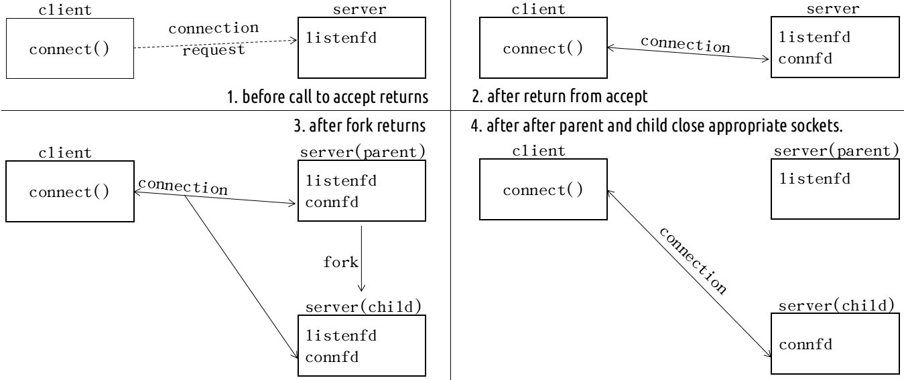

## 理解进程
“占用内存空间的正在运行的程序”，通过调用 fork() 函数创建进程
```
#include <unistd.h>
pid_t fork(void); // 成功时返回进程ID，失败时返回-1
```
fork() 函数将创建调用进程的副本--复制正在运行的、调用 fork() 函数的进程。另外，两个进程都将执行 fork() 函数调用后的语句（准确地说是在 fork() 函数返回后），之后的程序流要根据 fork() 函数的返回值加以区分。
- 在调用进程（称为父进程）中返回一次，返回值是子进程 ID 号
- 在子进程返回一次，返回值是 0

父进程中调用 fork() 之前打开的所有描述符在 fork() 返回之后与子进程共享；可以有多个子进程，必须用进程ID区分；但只有一个父进程，可以用 getppid() 获取父进程 ID

两个典型用法
  - 一个进程创建自身的副本，多个副本可以并发执行处理各自的操作
  - 一个进程创建自身的副本，然后在其中的一个副本（通常是自己那成）调用 exec() 把自身替换成新的程序

## exec() 函数
```
#include <unistd.h>
int execl(const char *pathname, const char *arg0, ...);
int execv(const char *pathname, char *const *argv[]);
int execle(const char *pathname, const char *arg0, ...);
int execve(const char *pathname, char *const argv[], char *const envp[]);
int execlp(const char *filename, cosnt char *arg0, ...);
int execvp(const char *filename, char *const argv[]);
```


## 并发服务器（fork() 实现）


## POSIX 信号处理
信号就是告知某个进程发生了某个事件的通知，有时也称为软件中断。信号通常是异步发生的
- 由一个进程发送给另一个进程（或自身）
- 由内核发送给某个进程

信号处理选择
- 提供一个函数，只要有特定信号发生它就被调用
- 把某个信号的设置为 SIG_IGN 来忽略它。 SIGKILL 和 SIGSTOP 不能忽略
- 默认处置 SIG_DFL

信号处理函数注册 signal() 和 sigaction() 函数
```
#include <signal.h>
void (*signal(int signo, void(*func)(int)))(int);

struct sigaction {
  void (*sa_hanlder)(int);
  void (*sa_sigaction)(int, siginfo_t *, void *);
  sigset_t sa_mask;  // 暂时初始化为0
  int sa_flags;      // 暂时初始化为0
  void (*sa_restorer)(void);
};
int sigaction(int signo, const struct sigaction *act, struct sigaction *oldact);
```
调用 siganl() 函数时，第一个参数为特殊情况信息，第二个参数为特殊情况下将要调用的函数的指针。发生第一个参数代表的情况时，（操作系统）调用第二个参数所指的函数。signo 部分值：
- SIGALRM：已到通过调用 alarm() 函数注册的时间
- SIGINT：输入 CTRL+C
- SIGCHLD：子进程终止

sigaction() 函数和 signal() 函数类似，而且完全可以替代后者，（接口）也更稳定

## POSIX 信号语义
- 一旦注册了信号处理函数，它便一直注册
- 在一个信号处理函数运行期间，正被递交的信号是阻塞的
- 如果一个信号在被阻塞期间产生了一次或多次，那么该信号被解阻塞之后只递交一次，也就是 UNIX 信号默认是不排队的

## 处理僵尸进程
僵尸进程就是父进程 fork() 之后并没有调用 wait() 处理子进程。在子进程退出的时候，内核释放该进程所有的资源，比如文件描述符，内存，等等，但是依然为该进程保留一定的信息（如PCB，允许父进程读取子进程exit status），只有该进程的父进程调用 wait() 之后才会释放掉这些保留的信息。如果父进程没有 wait() ，那么子进程就变成了僵尸进程。

可以调用 wait() 和 waitpid() 函数处理僵尸进程
```
#include <sys/wait.h>
pid_t wait(int *statloc);  // 成功时返回终止的子进程 ID，失败时返回 -1

/* @param
 * pid：等待终止的目标子进程的 ID，若传递 -1，则与 wait() 函数相同，可以等待任意子进程终止
 * statloc：与 wait() 函数 statloc 参数含义相同
 * options：传递头文件sys/wait.h中声明的常量 WNOHANG，即没有终止的子进程也不会进入阻塞状态，
 *          而是返回 0 并退出函数
 */
pid_t waitpid(pid_t pid, int *statloc, int options); // 成功时返回终止的子进程 ID（或0），失败返回 -1
```
调用此函数时如果已经有子进程终止，那么子进程终止时传递的返回值（exit 函数的参数值、main() 函数的 retrun 返回值）将保存到参数 stateloc 中。但是函数采纳数所指的单元中还包含其他信息，因此需要通过下列宏进行分离：
- WIFEXITED：子进程正常终止时返回真
- WEXITSATUS：返回子进程的返回值

两者区别：
- 如果调用 wait() 的进程没有已终止的进程，不过有一个或多个子进程仍在执行，那么 wait() 将阻塞到现有子进程第一个终止为止
- waitpid() 就等待哪个进程以及是否阻塞给了我们更多的控制。pid 参数运行我们指定像等待的进程 ID（-1 表示等待第一个终止的进程）；传递 WNOHNAG 给 options 可以告知内核在没有已终止子进程时不要阻塞

## SIGPIPE 信号
当一个进程向某个已收到 RST 的套接字执行写操作时，内核向该进程发送一个 SIGPIPE 信号。该信号的默认行为是终止进程，因此进程必须捕获它以免不情愿地被终止。

## accept() 返回前连接中止
三路握手完成从而连接建立之后，客户 TCP 却发送了一个 RST。在服务器端看来，就在该连接已由 TCP 排队、等着服务进程调用 accept() 的时候 RST 到达。稍后，服务进程调用 accept()。

如何处理这种中止的连接依赖于不同的实现：
- POSIX 实现，返回 ECONNABORTED 错误（errno）
- SVR4 实现，返回 EPROTO 错误（errno）
- 源自 Berkeley 的实现完全在内核中处理中止的连接，服务进程看不到。同时完成三次握手的连接会从已完成队列中移除。在这种情况下，如果我们用 select() 监听到有新的连接完成，但之后又被从完成队列中删除，此时如果调用阻塞 accept() 就会产生阻塞。解决办法：
  - 使用 select() 监听套接字是否有完成连接的时候，总是把这个监听套接字设置为非阻塞
  - 在后续的 accept() 调用中忽略以下错误，EWOULDBLOCK（Berkeley 实现，客户中止连接），ECONNABORTED（Posix 实现，客户中止连接），EPROTO (SVR4 实现，客户中止连接)和 EINTR（如果有信号被捕获）

## 服务器进程终止（崩溃）
在客户端和服务器端建立连接之后，使用 kill 命令杀死服务器进程，进程终止会关闭所有打开的描述符，这导致了其向客户端发送一个 FIN，而客户端不知道服务器端已经终止了，当客户端向服务器写数据的时候，由于服务器进程终止，所以响应了 RST，如果我们使用 select() 等方式，能够立即知道当前连接状态；如下：
- 如果对端 TCP 发送数据，那么套接字可读，并且 read() 返回一个大于 0 的值
- 如果对端 TCP 发送了 FIN（对端终止），那么套接字变为可读，并且 read() 返回0（读到 EOF）
- 如果对端 TCP 发送 RST（对端主机崩溃并重启），那么套接字变为可读，并且 read() 返回 -1，errno 中含有确切错误码

## 服务器主机崩溃
建立连接后，服务器主机崩溃，此时如果客户端发送数据，会发现客户端会在一定时间内持续重传，视图从服务器端收到数据的 ACK，当重传时间超过指定时间后，服务器仍然没有响应，那么返回 ETIMEDOUT 错误。

## 服务器主机崩溃后重启
当服务器主机崩溃后重启时，它的 TCP 丢失了崩溃前的所有连接信息，因此服务端 TCP 对于收到来自客户端的数据分节响应一个 RST。客户端套接字变为可读，并且 read() 返回 -1，errno 中含有确切错误码

## 服务器主机关机
UNIX 系统关机时，init 进程给所有进程发送 SIGTERM 信号（默认处置是终止进程），等待一端固定的时间（5～20 sec，清除和终止所有运行的进程），然后给所有仍在运行的进程发送 SIGKILL 信号（该信号不能被捕获）。当服务器子进程终止时，它的所有打开着的描述符都被关闭，随后发生的是和[服务器进程终止](##服务器进程终止（崩溃）)一样
