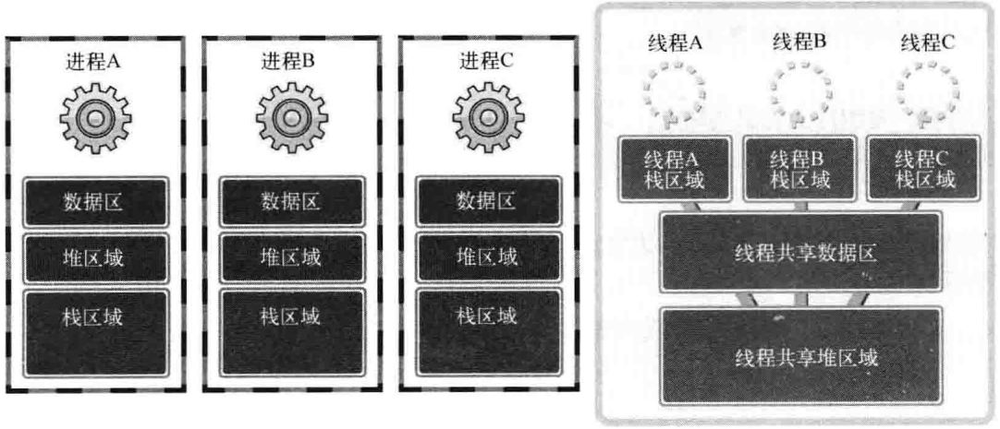
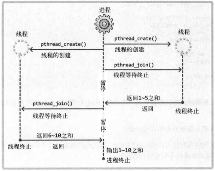

## 线程和进程的差异


- 每个进程拥有独立的内存
  - 在操作系统构成单独执行流的单位
- 同一进程的线程共享数据、堆区域，只需分离栈区域
  - 上下文切换时不需要切换数据区和堆
  - 可以利用数据区和堆交换数据
  - 在进程构成单独执行流的单位

### 线程创建及运行
线程具有单独的执行流，需要单独定义线程的 main() 函数，还需要请求操作系统在单独的执行流中执行该函数
```
#include <pthread.h>
/* @param
 * thread：保存新创建线程 ID
 * attr：传递线程属性的参数，传入 NULL，创建默认属性的线程
 * start_routine：相当于线程 main() 函数的、在单独执行流中执行的函数指针
 * arg：通过第三个参数传递调用函数时包含传递参数的变量地址
 * return：成功返回 0，失败返回其他值
 */
int pthread_create(
  pthread_t *restrict thread, const pthread_arrt_t *restrict attr,
  void *(*start_routine)(void *), void *restrict arg);
// 用 restrict 修饰一个指针，表示指针独享这片内存，所有修改都得通过这个指针进行

/* @param
 * thread：此 ID 的线程终止后才会从该函数返回
 * status：保存线程返回值
 * return：成功返回 0，失败返回其他值
 */
int pthread_join(pthread_t thread, void **status);
```

### 线程安全函数
- 多个线程同时调用时也不会发生问题
- 大多数标准函数都是线程安全函数
- 非线程安全函数对应的线程安全函数加`_r`后缀
  ```
  struct hostent *gethostbyname(const char *hostname);
  struct hostent *gethostbyname_r(const char *name, struct hostent *result, 
                                  char *buffer, int buflen, int *h_errnop);
  ```

### 工作（Worker）线程模型


### 线程存在的问题和临界区
- 多个线程访问同一变量的问题
  - 并发执行引发逻辑错误
- 临界区位置
  - 函数内同时运行多个线程时引起问题的多条语句构成的代码块