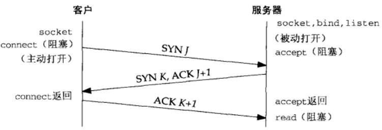
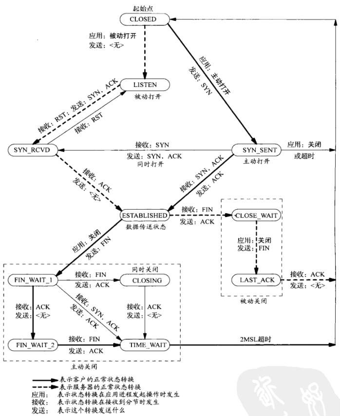

## UDP
- 简单的、不可靠的数据报协议
- 不保证 UDP 数据包会到达其最终目的地
- 不保证各个数据报的先后顺序跨网络后保持不变
- 不保证每个数据报只到达一次
- 数据有边界

## TCP
- 复杂的、可靠的字节流协议
- 提供客户与服务器之间的连接
- 提供了可靠性（确认与重传）
- 提供流量控制
  - 通告窗口：TCP 总是告知对端在任何时刻它一次能够从对端接收多少字节的数据。在任何时候、该窗口指出接受缓冲区中当前可用的空间量，从而确保发送端发送的数据不会使接收缓冲区溢出
- TCP 连接是全双工
  - 在一个给定的连接上应用可以在任何时刻在进出两个方向上既发送数据又接受数据

## TCP 连接的建立
1. 服务器必须准备好接受外来的连接。这通常通过依次调用 socket()、bind()、listen() 函数来完成，称之为被动打开
2. 客户通过调用 connect() 发起主动连接。这导致客户端 TCP 发送一个 SYN（同步）分节，它告诉服务器客户将在（待建立的）连接中发送的数据的初始序列号和自己最大段大小。通常 SYN 分节不携带数据，其所在 IP 数据报只有一个 IP 首部、一个 TCP 首部以及可能有的 TCP 选项
3. 服务器必须确认（ACK）客户的 SYN，同时自己也得发送一个 SYN 分节，它含有服务器将在同一连接中发送的数据的初始序列号和自己最大段大小。服务器在单个分节中发送 SYN 和对客户 SYN 的 ACK
4. 客户必须确认服务器的 SYN 分节

## TCP 连接终止
1. 某个应用进程（通常是客户端）首先调用 close()，称该端执行主动关闭。该端的 TCP 于是发送一个 FIN 分节，表示数据发送完毕
2. 接受到这个 FIN 的一端（接收端，通常是服务端）执行被动关闭。TCP 对 FIN 进行确认。FIN 的接收也作为一个文件结束符 EOF 传递给接收端应用进程（放在已排队等候应用进程接收的任何数据之后）
3. 一段时间后，被动关闭这端的应用进程将调用 close() 关闭它的套接字--发送 FIN（打开的套接字被关闭都会发送 FIN，比如调用 exit() 或从 main() 函数返回）
4. 执行主动关闭的一端对这个 FIN 进行确认

## TCP 状态转换图

## TIME_WAIT 状态
- 持续时长：最长分节生命期的两倍，2 MSL（Maximum Segment Lifetime）
- 可靠地实现 TCP 全双工连接的终止
  - 正确处理连接终止序列 4 个分节中最后一个分节丢失的情况
  - 主动关闭的一端可能不得不重传最终那个 ACK
- 让老的重复分节在网络中消失
  - TCP 必须防止来自某个连接的老的重复分节在该连接终止后出现，从而被误解成属于同一连接的某个新的化身（老的连接关闭后，在相同的 IP 和端口之间建立的另一个连接）
- 存在例外：如果到达的 SYN 的序列号大于前一化身的结束序列号，源自 Berkeley 的实现将给当前处于 TIME_WAIT 状态的连接启动新的化身。

## TCP 输出
当某个应用进程调用 write() 时，内核从该应用进程的缓冲区中复制所有数据到其套接字的发送缓冲区（位于内核中）。如果该套接字的发送缓冲区容不下该应用进程的所有数据（或是应用进程的缓冲区大于套接字的发送缓冲区，或是套接字的发送缓冲区已有其他数据），该应用进程将被投入睡眠（假设该套接字是阻塞的）。内核将不从 write() 系统调用返回，直到应用进程缓冲区中的所有数据都复制到套接字的发送缓冲区。因此，从写一个 TCP 套接字的 write() 调用成功返回仅仅表示应用可以重新使用原来的缓冲区，并不表明对端的 TCP 或应用进程已接受到数据。

## UDP 输出
没有发送缓冲区，但有发送缓冲区大小，仅仅表示可写到该套接字的 UDP 数据报的大小上限（写入数据大于该值，内核返回 EMSGSIZE 错误）。UDP 简单地给来自用户的数据报按上它的 8 字节的首部以构成 UDP 数据报，然后传递给IP。从写一个 UDP 套接字的 sendto() 或 write() 调用成功返回表示所写的数据报或其所有片段已被加入数据链路层的输出队列。如果该队列没有足够空间容纳该数据报或它的某个片段，内核返回 ENOBUFS 错误。