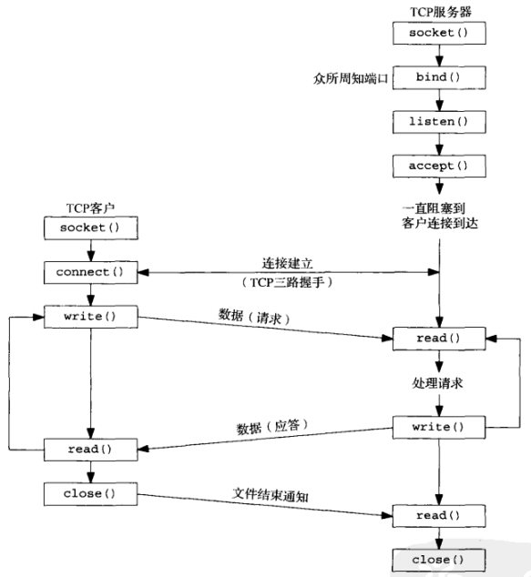
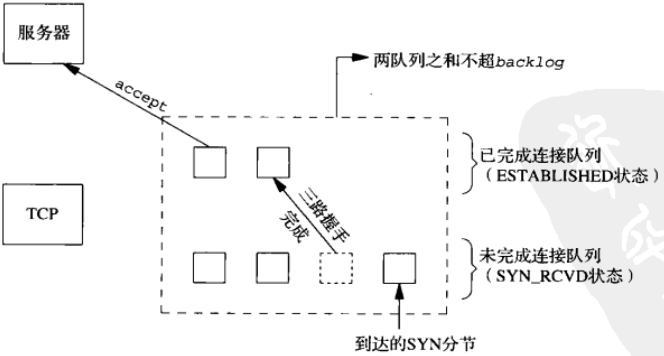
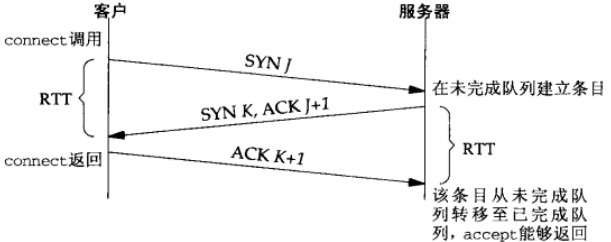
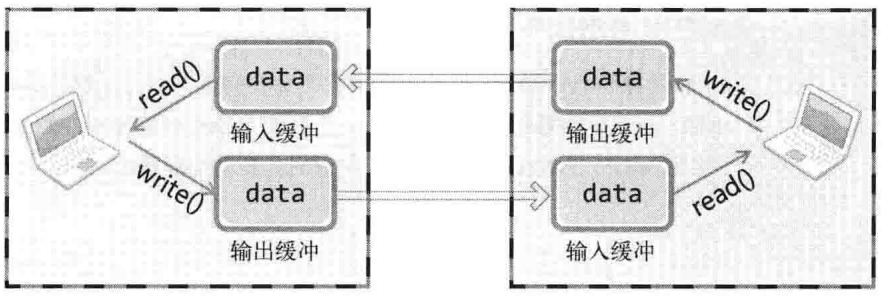

## 4、基本 TCP 套接字编程


## socket() 函数
```
#include <sys/socket.h>
/* @param
 * domain：套接字使用的协议族（Protocol Family）信息
 * type：套接字数据传输类型
 * protocol：计算机间通信中使用的协议信息
 * return：成功时返回文件描述符，失败时返回-1
 */
int socket(int family, int type, int protocol);
```
协议族（Protocol Family）
- PF_INET：IPv4 互联网协议族
- PF_INET6：IPv6 互联网协议族
- PF_LOCAL：本地通信的 UNIX 协议族
- PF_PACKET：底层套接字的协议族
- PF_IPX：IPX Novel 协议族

套接字类型
- 面向连接的套接字（SOCK_STREAM）
  - 可靠传输
  - 按序传输
  - 传输的数据没有边界（发送端多次发送，接受端可以一次接收）
- 面向消息的套接字（SOCK_DGRAM）
  - 强调快速传输而非传输顺序
  - 不可靠
  - 传输的数据有边界（发送端 N 发送，接受端 N 次接收）
  - 限制每次传输的数据大小

## connect() 函数
```
#include <sys/socket.h>
int connect(int sockfd, const struct sockadrr *addr, socklen_t addrlen); // 成功返回 -1，失败返回 -1
```
客户在调用函数 connect() 前不必非得调用 bind() 函数

如果是 TCP 套接字，调用 connect() 函数将激发 TCP 的三路握手，而且仅在建立成功或出错时才返回，错误的情况：
- （几次发送仍然）没有收到 SYN 分节的响应，返回 ETIMEDOUT 错误
- 收到的相应是 RST（表示复位），马上返回 ECONNREFUSED 错误。产生 RST 三个条件：
  - 目的地为某端口的 SYN 到达，然而该端口上没有正在监听的服务器
  - TCP 想取消一个已有的连接
  - TCP 接收到一个根本不存在的连接上的分节
- 若客户发出的 SYN 在中间的某个路由器引发 Destination Unreachable 的 ICMP 错误，客户主机内核保存该消息，（几次尝试后）仍未收到相应，则把保存的 ICMP 错误作为 EHOSTUNREACH 或 ENETUNREACH 返回给进程

## bind() 函数
```
#include <sys/socket.h>
int bind(int sockfd, const struct sockaddr *addr, socklen_t addlen);
```
- 可以指定一个端口，或指定一个IP地址，可以两者都指定，也可以两者都不指定
- 指定端口号为 0，内核在 bind() 被调用时选择一个临时端口
- 若没有绑定一个端口，当调用 connect() 或 listen() 时，内核为相应的套接字选择一个临时端口号

## listen() 函数
```
#include <sys/socket.h>
int listen(int sockfd, int backlog); // 成功返回-1，失败返回-1
```
listen() 函数仅由 TCP 服务端调用，它做两件事：
- 当 socket() 函数创建一个套接字时，他被假设为一个主动套接字（调用 connect() 发起连接的客户套接字）。listen() 函数把一个未连接的套接字转换成一个被动套接字，指示内核应接受指向该套接字的连接请求。调用 listen() 导致套接字从 CLOSED 状态转换到 LISTEN 状态
- 第二个参数规定类内核应该为相应的套接字排队的最大连接个数（Linux 的实现表示已完成连接队列的最大数目）

未完成连接队列和已完成连接队列
- 未完成连接队列，每个这样的 SYN 分节对应其中的一项：已有某个客户发出并到达服务器，而服务器正在等待完成相应的 TCP 三路握手过程。这些套接字处于 SYN_RCVD 状态
- 已完成连接队列，每个已完成 TCP 三路握手过程的客户对应其中一项。这些套接字处于 ESTABLISHED 状态



连接建立过程
- 当来自客户的 SYN 到达时，TCP 在未完成连接队列中创建一个新项（来自监听套接字的参数就复制到即将建立的连接中），然后响应三路握手的第二个分节：服务器的 SYN 响应，其中捎带对客户 SYN 的 ACK 。这一项一直保留在未完成连接队列中，直到三路握手的第三个分节（客户对服务器的 SYN 的 ACK）到达或该项超时为止。
- 三路握手正常完成，该项就从未完成连接队列移到已完成队列的队尾
- 当进程调用 accept() 时，已完成连接队列中的队头项将返回给进程，或者如果该队列为空，那么进程将被投入睡眠，直到 TCP 在该队列中放入一项才返回



## accept() 函数
```
#include <sys/socket.h>
int accept(int sockfd, struct sockaddr *addr, socklen_t *addrlen); // 成功返回文件描述符，失败返回-1
```
如果 accept() 成功，那么其返回值是由内核自动生成的一个全新描述符，代表与所返回客户的 TCP 连接

## read() & write()
将数据写入文件
```
#include <unistd.h>
ssize_t write(int fd, const void *buf, size_t nbytes); // 成功时返回写入的字节数，失败时返回 -1
```
读取文件中的数据
```
#include <unistd.h>
// 成功时返回读取的字节数（但是遇到文件结尾则返回 0），失败返回 -1
ssize_t read(int fd, void *buf, size_t nbytes); 
```

## TCP 套接字的 IO 缓冲
调用 write() 函数时，将数据移至输出缓冲，在适当的时候（不管是分别传送还是一次性传送）传向对发的输入缓冲。调用 read() 函数时，从输入缓冲读取数据



- IO 缓冲在每个 TCP 套接字中单独存在
- IO 缓冲在创建套接字时自动生成
- 即使关闭套接字也会继续传递输出缓冲中遗留的数据
- 关闭套接字将丢失输入缓冲中的数据

## close() 函数
```
#include <unistd.h>
int close(int sockfd);
```
描述符引用计数减 1，若为 0，清理和释放相应的资源

## getsockname() 和 getpeername() 函数
或者返回与某个套接字关联的本地协议地址 getsockname()，或者返回与某个套接字关联的远端协议地址 getpeername()
```
#include <sys/socket.h>
int getsockname(int sockfd, struct sockaddr *localaddr, socklen_t *addrlen);
int getpeername(int sockfd, struct sockaddr *peeraddr, socklen_t *addrlen);
```

## shutdown()
close() 函数意味着完全断开连接。完全断开连接不仅无法传输数据，而且也不能接收数据

shutdown() 支持半关闭，表示一方传输数据完毕（接收方接收到 FIN 后向输入缓冲区写入 EOF），但是仍然可以接受数据
```
#include <sys/socket.h>
/* @param
 * sock：需要断开的套接字文件描述符
 * howto：传递断开方式信息
 *        SHUT_RD：断开输入流
 *        SHUT_WR：断开输出流
 *        SHUT_RDWR：同时断开输入输出流
 */
int shudown(int sock, int howto);
```
close() 和 shutdown() 比较
- close() 把描述符的引用计数减 1，仅在该计数变为 0 时才关闭套接字。使用 shutdown() 可以不管引用计数就激发 TCP 的正常连接终止序列
- close() 终止读和写两个方向的数据传送。shutdown() 指定读、写或全部连接关闭