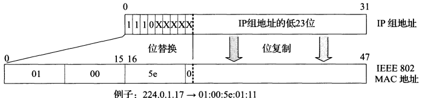

## 广播和本地组播
广播和组播为应用程序提供了两种服务：（1）数据分组交付至多个目的地；（2）客户端请求/发现服务器。使用广播或组播，应用程序可以将信息交付至多个收件方，或可以向一个服务器发送一个请求，而不用知道任何特定服务器的 IP 地址（例如 DHCP）。

广播是指将报文发送到网络中所有的可能接受者。在原理上，路由器简单地将它接收到的任意报文副本转离除报文到达的接口以外的每个接口。当有多个主机连接到同一个本地局域网，使用链路层广播将分组送达每个主机。IP 广播地址是除了网络地址外，其余主机地址全部为 1。例如希望向网络地址 192.12.34 中的主机传输数据时，广播地址为 192.12.34.255。另外本地广播使用的 IP 地址限定为 255.255.255.255，表示向本地网络的所有主机发送数据。MAC 广播地址 0xFF-FF-FF-FF-FF-FF。一般来说，使用广播的应用程序使用 UDP 协议（或 ICMP 协议），打开套接字的 SO_BROADCAST 选项。
```
/// sender
int so_brd = 1;
setsockopt(send_sock, SOL_SOCKET, SO_BROADCAST, (void*)&so_brd, sizeof(so_brd));

/// receiver
/// same as UDP receiver
```

组播（多播）技术有效地解决了单点发送、多点接收的问题。组播源只发送一份数据，被传递的信息在距组播源尽可能远的网络节点才开始被复制和分发，并且只发送给需要该信息的接收者。组播只向那些对它感兴趣的接收方发送流量。实现组播比广播更具挑战性，因为组播状态必须由主机和路由器来保持，以说明那些接收方对哪类流量有兴趣。在组播 TCP/IP 模型中，接收方通过指明组播地址（通过设置套接字选项加入 IP_ADD_MEMBERSHIP 或离开 IP_DROP_MEMBERSHIP）和可选源列表来表明它们希望接收的流量。这个信息作为主机和路由器的软状态来维持，它必须定期更新或超时删除。
```
/// sender
#define TTL 64
int time_to_live = TTL;
setsockopt(send_sock, IPPROTO_IP, IP_MULTICASE_TTL, (void*)&time_to_live, sizeof(time_to_live));

/// receiver
struct ip_mreq join_addr;
join_addr.imr_multiaddr.s_addr = inet_addr(GROUP_IP);
join_addr.imr_interface.s_addr = htonl(INADDR_ANY);
setsockopt(recv_sock, IPPROTO_IP, IP_ADD_MEMBERSHIP, (void*)&join_addr, sizeof(join_addr));
```
为了在链路层网络中有效地承载 IP 组播，IP 层的分组和链路层的帧应该有一个一对一的映射。IANA 拥有的以太网组播地址的范围是从 0x01-00-5E-00-00-00 到 0x01-00-5E-7F-FF-FF，每个地址中只有 23 位可用于组播。这只能和 D 类 IP 地址中的 23 位有一一对应关系。由于组播 IP 地址与以太网硬件地址的映射关系不是唯一的，因此收到组播数据报的主机，还要在 IP 层利用软件进行过滤（在网络接口卡 NIC 上发生，只接收发往本网卡的帧、广播的帧和本主机加入的多播组的帧），把不是本主机要接受的数据报丢弃。


为了使路由器知道组播组成员的信息，需要利用 IGMP（Inernet Group Management Protocol），让连接在本地局域网上的组播路由器知道本局域网上是否有主机参加或退出了某个组播组。主机每加入或离开一个多播组，就发送一个 IGMP 报文。