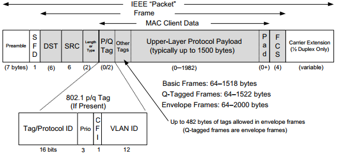

## 以太网帧

以太网基本的帧格式包括 48 位（6 字节）的目的地址（DST）和源地址（SRC）字段。以太网的目的地址也允许寻址到多个站点（称为广播或组播），广播功能用于 ARP 协议，组播功能用于 ICMPv6 协议，以实现网络层地址和链路层地址之间的转换。

源地址后面紧跟着一个 16 位类型字段或长度字段。在多数情况下，它用于确定头部后面的数据类型，以及选择处理它的网络层协议。TCP/IP 网络使用的常见值包括 IPv4（0x0800）、IPv6（0x86DD）和 ARP（0x0806）。以太网帧的数据或有效载荷部分，存放高层 PDU。

以太网帧有最小和最大尺寸。最小的帧是 64 字节，要求数据区长度（无标签）最小为 48 字节（64 - 6 - 6 - 4 - 2），当有效载荷较小时，填充字节（值为零）被添加到有效载荷尾部，以确保达到最小长度。以太网最大帧长度是 1518 字节（包括 4 字节 CRC 和 14 字节头部 6 + 6 + 2）。