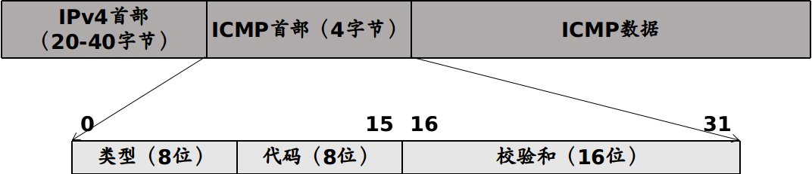

## 网际控制报文协议（Internet Control Message Protocol, ICMP）
IP 协议本身并没有为终端系统提供直接的方法来发现那些发往目的地址失败的 IP 数据分组，也没有提供直接的方式来获取诊断的信息。为了解决这些不足之处，将一个特殊的 ICMP 与 IP 结合使用，以便提供与 IP 协议层配置和 IP 数据分组相关的诊断和控制信息。ICMP 通常被认为是 IP 层本身的一部分，并且它必须与 IP 实现结合，使用 IP 协议进行传递。因此，它其实既不是网络也不是传输协议，而是位于两者之间。在 IPv4 中，协议字段为1表示该分组携带类 ICMPv4。

常用 ICMP 报文类型（E表示差错报文，I表示信息或查询报文）

| 类型 | 正式名称   |  E/I  | 用途/注释                        |
| :--- | :--------- | :---: | :------------------------------- |
| 0    | 回显应答   |   I   | 回显 ping 应答，返回数据         |
| 3    | 目的不可达 |   E   | 不可达的主机/协议                |
| 4    | 源端抑制   |   E   | 表示拥塞（启用）                 |
| 5    | 重定向     |   E   | 表示下次应该将数据发送另外的路由 |
| 8    | 回显       |   I   | 回显 ping 请求（数据可选）       |
| 9    | 路由器通告 |   I   | 指示路由器地址/优先级            |
| 10   | 路由器请求 |   I   | 请求路由器通告                   |
| 11   | 超时       |   E   | 资源耗尽（例如 IPv4 TTL 为零）   |
| 12   | 参数问题   |   E   | 有问题的数据包或者头部           |

ICMP 两个常用的应用
1. ping
   - 用来测试两个主机之间的连通性，工作在应用层，直接使用 ICMP（回显请求和回显应答），没有使用传输层的协议。
   - 当一个新的 ping 程序实例运行时，序列号字段从 0 开始，并且每发送一个回显请求报文，序号加 1。ping 打印出每个返回的数据报的序号，方便用户查看数据包是否丢失、重排或者重复。
   - ping 程序也在传出的回显请求中的可选数据区域中包含了一份本地时间拷贝，这个时间包含在返回的回显应答报文中。当应答收到时，ping 程序用当前时间它减去它，便得到一个 RTT 值
2. traceroute
   - 用来确定从发送者到目的路径经过的路由器，工作在网络层。
   - 该方法首先发送 TTL 字段为 1 的IPv4 分组，到期的数据报文促使沿途路由器发送 ICMP 超时报文。每一轮，发送的 TTL 加 1，导致数据报在更远一跳的路由器处超时。

不应发送 ICMP 差错报告报文的几种情况
1. 对 ICMP 差错报文不再发送 ICMP 差错报告报文
2. 对一个分组的所有后续分组都不发送 ICMP 差错报告报文
3. 对具有组播地址的数据都不发送 ICMP 差错报告报文
4. 对具有特殊地址（如 127.0.0.0 或 0.0.0.0）的数据报不发送 ICMP 差错报告报文