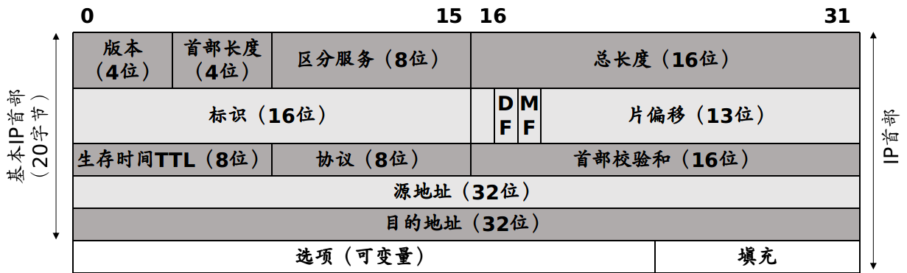

## IP 协议
IP 协议提供了一种尽力而为、无连接的数据报交付服务，不保证 IP 分组（Package）能成功到达目的地，每个数据报独立于其他数据报来处理，不保证按顺序交付。

Inetnet 首部长度（IHL）保存 IPv4 首部（包括选项）中 32 位字的数量。头部校验和仅计算 IPv4 首部，IP 协议不检查 IPv4 数据报有效载荷（TCP 或 UDP 数据）的正确性。为了确保 IP 数据报的有效载荷部分已正确传输，其他协议必须通过自己的数据完整性检验机制检查重要的数据。我们看到封装在 IP 中的几乎所有协议（ICMP、IGMP、UDP 和 TCP）在自己首部都有一个涵盖其头部和数据的校验和。8 位 IPv4 协议字段，以决定接下来调用那个协议来处理。常见的值包括 1（ICMP）、2（IGMP）、4（IPv4）、6（TCP）和 17（UDP）。