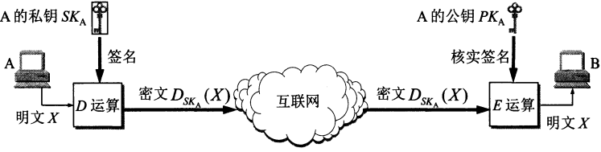
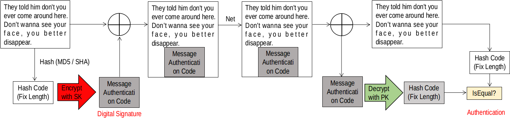

## 对称密钥密码体制
加密密钥与解密密钥是使用相同的密码体制。数据加密标准 DES 属于对称密钥密码体制，是一种分组密码，在加密前，先对整个明文进行分组，每组为 64 位长的二进制数据。然后对每一个 64 位二进制数据进行加密，产生一组64位密文数据。使用的密钥占有 64 位（实际密钥长度为 56 位，外加 8 位用于奇偶校验）。DES 的保密性取决于对密钥的保密，而算法是公开的。

## 公钥密码机制
使用不同的加密密钥与解密密钥。加密密钥 PK（Public Key，即公钥）是向公众公开的，而解密密钥 SK（Secret Key，即私钥或秘钥）则是需要保密的。加密算法 E 和解密算法 D 也都是公开的。只要密钥不丢失，下面传输是安全的。

## 数字签名
数字签名必须保证能够实现以下三点功能：
- 接收者能够核实发送者对报文的签名--报文鉴别
- 接收者确信所收到的数据和发送者发送的完全一样而没有被篡改过--报文的完整性
- 发送者事后不能抵赖对报文的签名--不可否认

数字签名和报文鉴别，当然，也可以将数据用对端的公钥加密，然后传输
