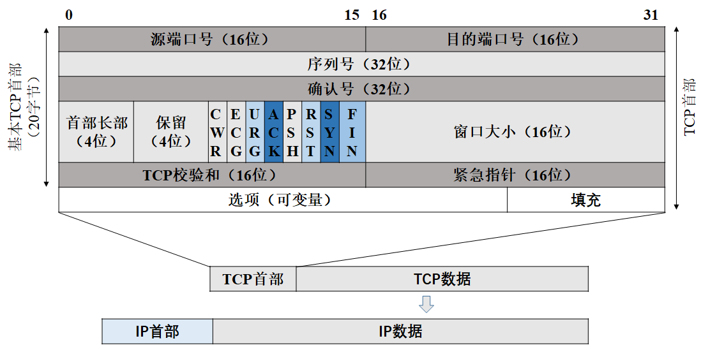
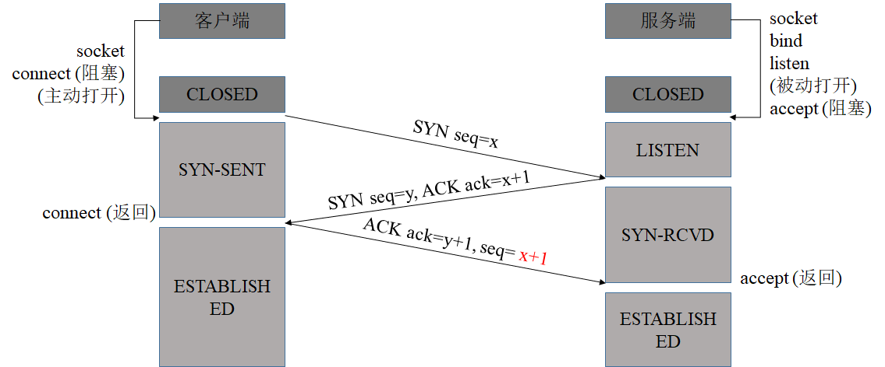
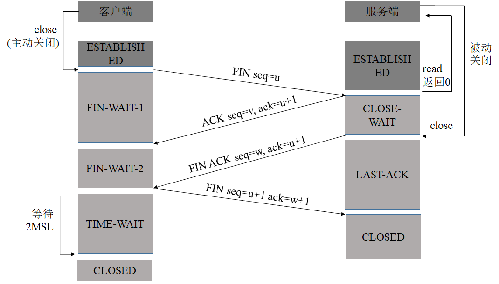
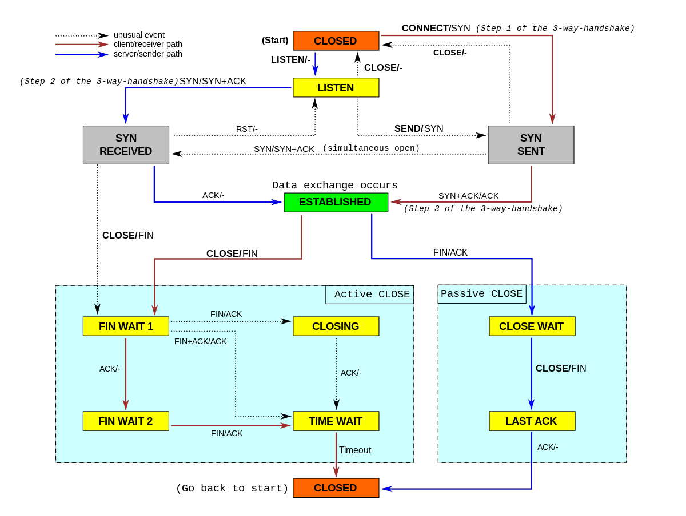

## TCP 协议
TCP 提供一种面向连接的、可靠的字节流服务。使用 TCP 的两个应用程序必须在他们可交换数据之前，通过相互联系建立一个 TCP 连接。此外，TCP 的字节流服务，表示没有由 TCP 自动插入的记录标签或消息边界。

## TCP 头部

## TCP 连接建立（三次握手）

1. CLOSED：起始点，在超时或者连接关闭进入此状态。这并不是一个真正的状态，而是一个假想起点和终点
2. LISTEN：服务器端等待连接的状态。服务器依次调用 socket()、bind()、listen() 函数之后进入此状态，开始监听客户端发过来的连接请求。此称为被动打开（等待客户端的连接请求）
3. SYN_SENT：第一次握手发生阶段，客户端主动打开，发起连接。客户端调用 connet() 函数，发送 SYN 分节（Segment）给服务器，指明对方端口号和自己的初始序列号和最大段大小，然后进入 SYN_SENT 状态，等待服务器端确认（三次握手的第二个报文）。如果服务器不能连接，则进入 CLOSED 状态。TCP 规定，SYN 报文段不能携带数据，但需要消耗掉一个序号（SYN 需要被确认）。
4. SYN_RCVD：第二次握手发生阶段，服务器接收到了客户端的 SYN 分节，此时服务器进入 SYN_RCVD 状态。服务器发送一个 ACK 对收到客户端的 SYN 分节进行确认，同时发送一个 SYN 分节，告诉客户端自己的初始序列号和最大段大小。这个报文也不能携带数据，但是同样要消耗一个序号。
5. ESTABLISHED：第三次握手发生阶段，客户端发送一个 ACK 分节对收到服务器的 SYN 进行确认，客户端进入 ESTABLISHED 状态，表明客户端这边已经准备好。服务器收到客户端的 ACK 之后进入 ESTABLISHED 状态，表明服务端也准备好，双方可以通信。TCP 规定，ACK 报文段可以携带数据，但是如果不携带数据则不消耗序号。

## TCP 连接释放（四次挥手）

1. FIN_WAIT_1：第一次挥手。客户端应用进程首先调用 close()，称该端执行主动关闭。发送 FIN 分节，表示数据发送完毕，终止连接，然后等待对方确认，进入 FIN_WAIT_1 状态。TCP 规定，FIN 分节即使不携带数据，也要消耗一个序号。
2. CLOSE_WAIT：第二次挥手。收到这个 FIN 的服务器执行被动关闭，发送 ACK 对收到 FIN 进行确认。 FIN 接收也作为一个文件结束符 EOF 传递给高层的应用进程，表示客户端到服务器的连接释放了。此时进入 CLOSE_WAIT 状态。
3. FIN_WAIT_2：执行主动关闭的客户端收到服务端的 ACK 分节，进入此状态，等待服务器发送 FIN，释放连接。
4. LAST_ACK：第三次挥手，被动方（服务器端）发送 FIN 分节，释放连接，等待客户端确认，服务器端进入 LAST_ACK 状态。
5. TIME_WAIT：第四次挥手，客户端发送 ACK 对收到 FIN 进行确认，进入 TIME_WAIT 状态。此时 TCP 连接还没有释放，必须经过 2 MSL（最长报文寿命）的时间后，才进入 CLOSED 状态。
6. CLOSED：服务器端收到 ACK 后进入 CLOSED 状态，客户端等待 2 MSL 时间后（期间没有收到服务器的超时重传报文）进入CLOSED 状态

## TCP 连接建立和释放疑难点
1. 初始序列号有什么特殊的要求
   - 初始序列号可被视为一个 32 位的计数器，该计数器的数值每 4 微秒加 1，此举的目的在于为不同连接分配不同初始序列号，尤其是为同一个连接的两个不同实例分配不同的初始序列号。因为一个 TCP 连接是被一对套接字所唯一标识，其中包括由两个 IP 地址和两个端口号构成的 4 元组，因此即使是同一个连接也会出现不同的实例（设置 SO_REUSEPORT 后，多个监听描述符可以绑定同一地址）。
2. SYN 分节是否消耗序列号， FIN 和 ACK 分节呢，为什么？
   - FIN 和 SYN 消耗一个序列号，为了保证可靠传输（接收方需要对此发送 ACK 进行确认）。 ACK 不消耗序列号
3. 为什么会有最后一次确认？两次握手不行吗？
   - 最后一次握手是为了防止前两次握手已失效的连接请求突然又传到服务端，而产生错误。考虑两次握手下面这种情况：客户端向服务器发出 TCP 连接请求，第一个 SYN 分节在网络的某个结点长时间滞留，客户端超时后认为报文丢失，于是再重传 SYN 分节，服务器收到后建立连接。数据传输完毕后双方断开连接。而此时前一个滞留在网络中的 SYN 到达服务器，服务器认为客户端又发送连接请求，服务端向客户端返回确认报文，服务器和客户端再次建立连接。服务器一直等待客户端传输数据，而此时客户端并没有连接请求，这导致不必要的错误和资源浪费。若采用三次握手，客户端不理会服务端的确认，服务器收不到客户端的确认，建立连接失败。
4. 为什么不采用三次挥手释放连接，且最后发送最后一次挥手后要等待 2 MSL 的时间呢？
   - 第一为了保证最后一个 ACK 能够到达。最后一个 ACK 分节可能丢失，如果客户端不等待 2 MSL，可能的结果是服务器超时重传 FIN 分节，而此时客户端已经关闭，不能发送 ACK 确认，服务器不能正常释放连接。若客户端等待了 2 MSL，客户端收到 FIN 后发送 ACK ，并且重启计时器，再次等待 2 MSL。
   - 第二，防止类似“已经失效的连接请求报文段”出现在本连接中。客户端发送完最后一个确认报文后，在这个 2 MSL时间中，就可以使本连接持续的时间内所产生的所有报文段都从网络中消失。这样新的连接中不会出现旧连接的请求报文。
5. 为什么建立连接是三次握手，关闭连接却是四次挥手呢？
   - 建立连接的时候， 服务器在 LISTEN 状态下，收到建立连接请求的 SYN 报文后，把 ACK 和 SYN 放在一个报文里发送给客户端。而关闭连接时，服务器收到对方的 FIN 报文时，仅仅表示对方不再发送数据了但是还能接收数据，而自己也未必全部数据都发送给对方了，并且需要将 FIN 作为 EOF 提交给应用进程。所以己方可以立即关闭，也可以发送一些数据给对方后，再发送 FIN 报文给对方来表示同意现在关闭连接，因此，己方 ACK 和 FIN 一般都会分开发送，从而导致多了一次
6. 如果已经建立了连接，但是客户端突然出现故障了怎么办？
   - TCP 还设有一个保活计时器，显然，客户端如果出现故障，服务器不能一直等下去，白白浪费资源。服务器每收到一次客户端的请求后都会重新复位这个计时器，时间通常是设置为 2 小时，若两小时还没有收到客户端的任何数据，服务器就会发送一个探测报文段，以后每隔 75 秒发送一次。若一连发送 10 个探测报文仍然没反应，服务器就认为客户端出了故障，接着就关闭连接。

## TCP 状态转换图
