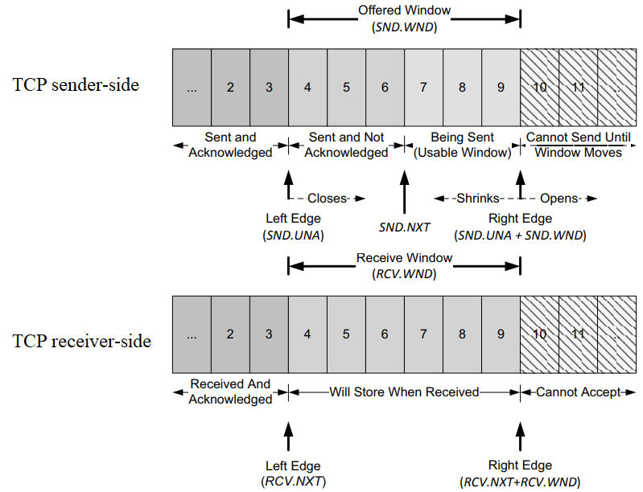

### TCP 流量控制

#### 延迟 ACK 
TCP 并不对每个到来的分节都返回 ACK。累计确认可以允许 TCP 延迟一段时间发送 ACK，如果这段时间内有数据发送到对端，则捎带发送 ACK，如果在 ACK 定时器触发时候，发现 ACK 尚未发送，则立即单独发送；

延迟 ACK 好处：

- 避免糊涂窗口综合症；
- 发送数据的时候将 ACK 捎带发送，不必单独发送 ACK；
- 如果延迟时间内有多个数据段到达，那么允许协议栈发送一个 ACK 确认多个报文段；

#### Nagle 算法
该算法要求，当一个 TCP 连接中有待确认数据，小的分节（长度小于 MSS）就不能发送，直到所有的待确认数据都收到 ACK。并且在收到 ACK 后，TCP 需要收集这些小分节，将其整合到一个分节发送。该算法的优越之处在于它是自适应的，ACK 返回越快，数据也就发送的越快；在相对高时延的广域网中，更需要减少微小分节的数目，该算使得单位时间内发送的分节数目更少。也就是说，RTT 控制着发送速率。

#### 滑动窗口

TCP 以字节为单位维护其窗口结构。由接收端通告的窗口称为提供窗口。窗口大小字段是相对于 ACK 号的字节偏移量。发送端计算其可用窗口，即它可以立即发送的数据量。可用窗口计算值为提供窗口大小减去在传（已发送但未得到确认）的数值。窗口左边界不能左移，因为它控制的是已确认的 ACK 号，具有累计性，不能返回。在通信的过程中，接收方根据自己接收缓存的大小，动态地调整发送方的提供窗口大小，同时发送方根据其对当前网络拥塞程度的估计确认拥塞窗口大小，最后发送端的是提供窗口大小和拥塞窗口大小的最小值。当提供窗口大小为零，成为零窗口，此时发送端不能再发送新数据。这种情况下，TCP 发送端开始探测对方窗口大小。