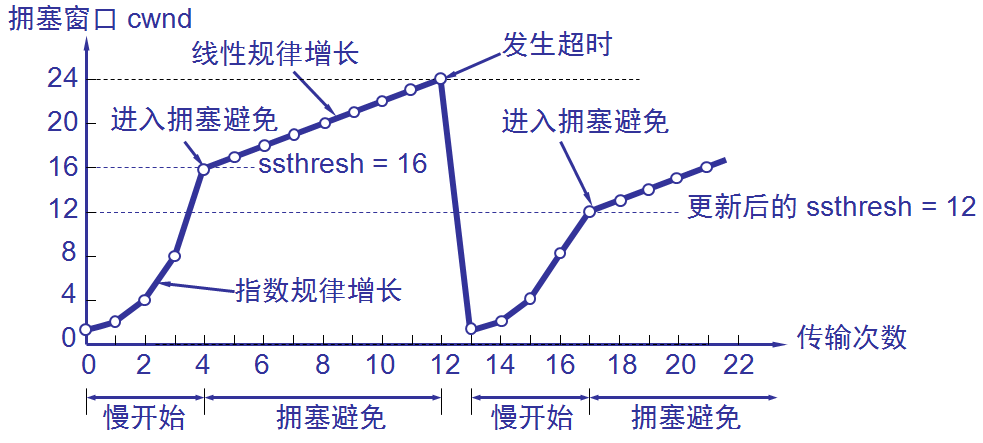
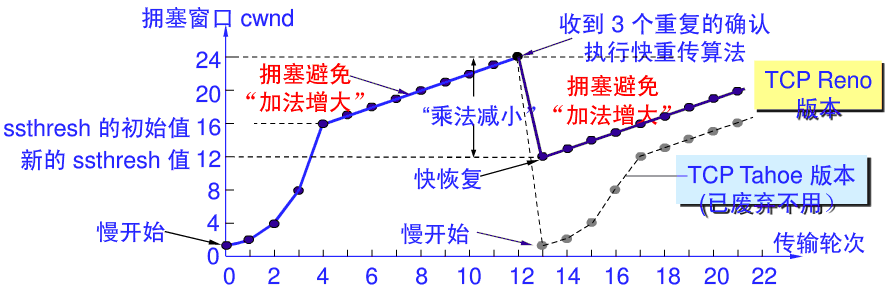

## 流量控制和拥塞控制
流量控制的目的是消除发送方使接收方缓冲区发生溢出的可能性，是点对点的控制。接收方会根据自己接收缓冲区的大小，动态地调整发送方的发送窗口的大小。它是基于 ACK 分节中的窗口大小字段来实现的。拥塞控制目的是防止过多的数据注入网络中，造成路由器无法处理高速到达的流量而被迫丢弃数据信息（拥塞），是一个全局性的过程，涉及所有主机、路由器等。两者也有相似的地方，都是通过控制发送方发送数据的速率来达到效果的。

## 慢启动算法
当一个新的 TCP 连接建立或发生超时重传的丢包，需要启动慢启动，或者发送端长时间处于空闲状态，也可能启动慢启动。慢启动的目的是：在 TCP 用拥塞避免算法探寻更多可用带宽之前，得到拥塞窗口（congeston window）大小。以帮助 TCP 建立 ACK 时钟。通常，TCP 在建立新连接时执行慢启动，直至有丢包时，执行拥塞避免算法，进入稳定状态。

在 TCP 刚刚建立好，开始发送 TCP 分节时，先令拥塞窗口 cwnd = 1，即一个最大段大小 MSS。而在每收到一个对新的分节的确认后，将 cwnd 加 1，即增大一个 MSS。用这样的方法逐步增大发送方的拥塞窗口，可使分节注入网络的速率更加合理。一般情况下，如果成功收到相应的新的 ACK，cwnd 呈指数增长。

## 拥塞避免
在慢启动阶段，cwnd 会快速增长，一旦达到阈值（慢启动阈值，ssthresh），就意味着可能有更多可用的传输资源。但是如果立即全部占用这些资源，将会使共享路由器队列的其他连接出现严重的丢包和重传情况，从而导致整个网络性能不稳定。为了得到更多的传输资源且不至于影响其他连接的传输，改用拥塞避免算法。

拥塞避免算法的做法是：发送端的拥塞窗口 cwnd 每经过一个往返时延 RTT 就增加一个 MSS 的大小，而不是加倍，使 cwnd 按线性规律缓慢增长（即加法增大），而当出现一次超时（网络拥塞）时，令慢启动门限 ssthresh 等于当前 cwnd 的一半（即乘法减小）但不能小于 2。

## 网络拥塞的处理
无论在慢启动阶段还是拥塞避免阶段，只要发送方检测到超时事件的发生，就表明网络出现拥塞，就要把慢启动门限 ssthresh 设置为当前 cwnd 的一半（但不能小于 2），然后就把拥塞窗口 cwnd 重新设置为 1，执行慢启动算法。这样做的目的是：快速减少主机发送到网络中的数据，使得发生拥塞的路由器有足够时间把队列积压的分组处理完毕。

## 快重传和快恢复
快重传和快恢复算法是对慢启动和拥塞避免算法的改进

### 快重传
冗余 ACK 也用于网络拥塞的检测（丢包意味着网络可能出现了拥塞），快重传并非取消重传计时器，而是当发送方连续收到三个重复的 ACK 报文时，直接重传对方尚未收到的分节，而不必等待那个分节设置的重传计时器超时。

### 快恢复（Reno版本）
快恢复算法原理：当发送端收到连续三个冗余 ACK 时，就执行“乘法减小”算法，把慢启动门限 ssthresh 设置为出现拥塞时发送方 cwnd 的一半，并且将 cwnd 设置为新的 ssthresh 值，然后开始执行拥塞避免算法（“加法增大”），使拥塞窗口缓慢地线性增大。

