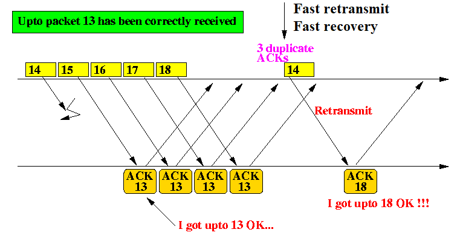

## TCP 可靠传输
TCP 使用了校验和、序号、确认和重传等机制实现可靠传输

## 校验和
TCP 首部的校验和字段是首部和数据的校验和

## 序号
TCP 首部的序号字段用来保证数据能有序地提交给应用进程，TCP 把数据看成一个无结构但是有序的字节流，而序号是建立在传送的字节流之上的。TCP 连接中传送的数据流中的每个字节都被编上一个序号。序号字段的值则指本分节所发送的数据的第一个字节的序号。

## 确认
TCP 首部的确认号（ACK 标志置 1 确认号才有效）是期望收到对方的下一个分节的数据的第一个字节的序号。发送方缓存会继续存储那些已经发送但未收到确认的数据，以便在需要的时候（超时）重传。TCP 默认使用累计确认，累积确认可以允许 TCP 延迟一段时间发送 ACK，以便将 ACK 和相同方向上需要传的数据结合发送。

## 重传
TCP 拥有两套独立机制来完成重传，一是基于时间，二是基于冗余 ACK 。TCP 在发送数据时会设置一个计时器，若计时器超时仍未收到数据确认，则会引发超时重传。另一种方式的重传称为快速重传，若累计确认无法返回新的 ACK，快速重传会推断出现丢包。

### 超时重传
TCP 每发送一个分节时，该分节的一个副本就会被挂到重传队列上，同时启动一个重传计时器。重传队列按照重传计时器中剩余时间进行排序。每收到一个确认，就会重启相应的计时器。如果某个分节的数据已经全部确认，就把该分节从重传队列中删除。如果在重传计时器发生超时，就会重传相应的分节，它并不需要完全重传相同的分节。TCP 允许执行重新组包，发送一个更大的分节来提高性能。

标准方法通过记录往返时间(Round-Trip Time, RTT)测量值的变化情况以及均值来得到较为准确的估计值，基于均值和估计值的变化来设置超时重传时间(Retransmission Time-Out, RTO)。考虑到效率等问题，用平均偏差近似标准差。对每个 RTT 测量值 M，进行如下运算：
```
srtt = (1 - g) * srtt + g * M
rttvar := (1 - h) * rttvar + h * |M - srtt|
RTO = srtt + 4 * rttvar
```
其中 g 取为 1/8，h 取为 1/4。RTO 的初始值为 1s，而初始 SYN 分节采用的超时间隔为 3s。当接收到首个 RTT 测量结果 M，估计值按如下方法进行初始化：
```
srtt = M
rttvar = M / 2;
```
一旦 TCP 发送端得到了基于时间变化的 RTT 测量值，就能根据此设置 RTO，发送分节时应确保重传计时器设置合理。若在设定的 RTO 内，TCP 没有收到被计时分节的 ACK，将会触发超时重传。当发生这种情况时，TCP 通过降低当前数据发送速率来对此进行快速响应。它有两种方法：一是基于拥塞控制机制减小发送窗口大小；另一种是每当一个重传分节被再次重传时，则增大 RTO 的退避因子。特别地当同一个分节出现多次重传时，RTO 暂时乘上 y 来形成新的超时退避值：RTO = y * RTO。在通常情况下，y 值为 1。随着多次重传，y 加倍增长：2，4，8 等等。

### 快速重传（冗余 ACK ）
快速重传机制基于接收端的反馈信息来引发重传，能更加及时有效地修复丢包情况。TCP 规定每当收到失序分节时（收到比期望序号大的分节）时，立即生成确认信息，不能延时发送，及时告知发送端有失序分节并告诉其空缺在哪。失序现象表明在后续数据到达前出现了丢包，发送端应尽快地、高效地填补该空缺。TCP 标准规定当发送方收到同一个报文的 3 个冗余 ACK 时触发快速重传，而不必等到重传计时器超时。当然也可以同时发送新的数据。
